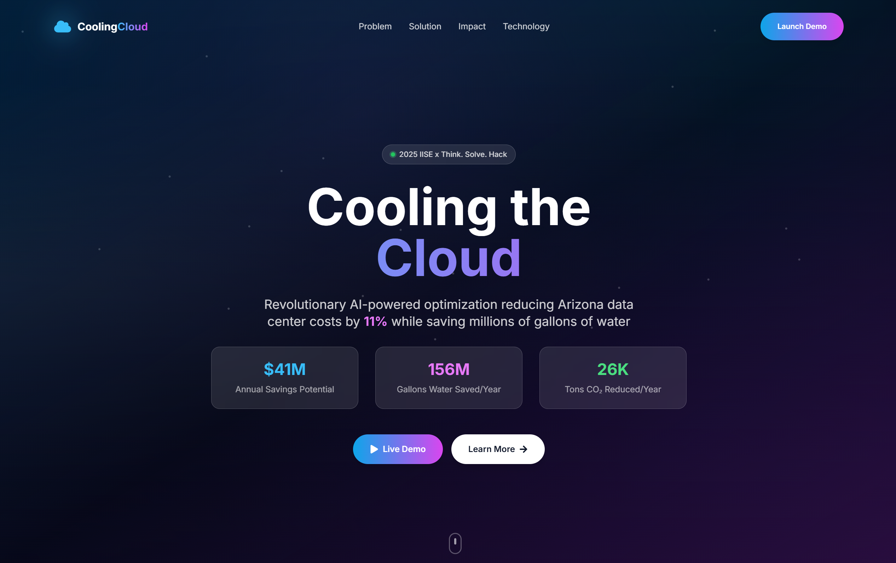
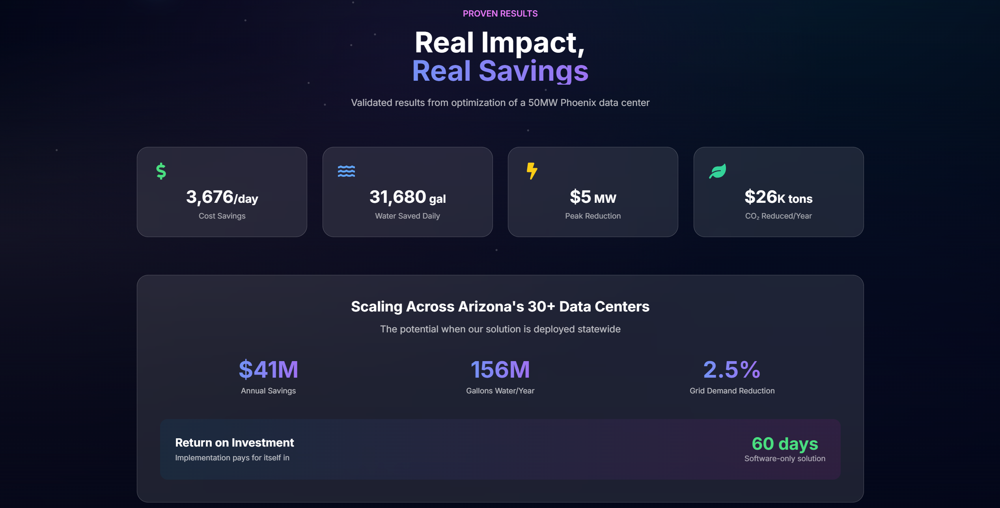
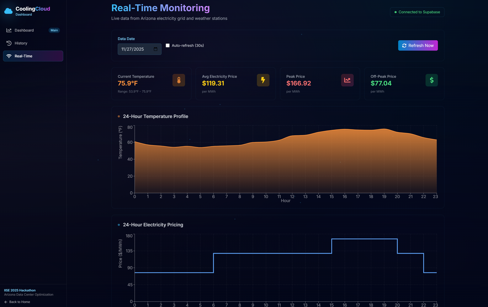

# Cooling the Cloud

[](LICENSE)
[](https://www.python.org/downloads/)
[](https://www.iise.org/)

> 🏆 **2nd Place — IISE Think.Solve.Hack 2025** | AI-powered optimization that cuts Arizona data center costs by 12.6% while saving millions of gallons of water annually.

### TL;DR
Full-stack optimization system (React + Flask + Pyomo) that reduces data center cooling costs by **12.6%** and saves **467M gallons of water/year** — with live dashboard and real EIA/NOAA data integration.

> *Originally developed at [Automynx/Cooling-The-Cloud](https://github.com/Automynx/Cooling-The-Cloud) as a team project for IISE Think.Solve.Hack 2025.*



### Quick Start (No API Keys Required)
```bash
# Terminal 1: Frontend
cd cooling-cloud-react && npm install && npm run dev

# Terminal 2: Backend
python api_server.py
```
Open **http://localhost:3000** → Click "Launch Demo"

## Overview

Arizona data centers face a critical challenge: extreme heat drives up cooling costs while the state battles severe water scarcity. During peak hours (3-8 PM), electricity prices surge 5x while temperatures exceed 115°F, forcing operators to choose between expensive electric cooling or water-intensive evaporative systems. Our optimization engine solves this problem by intelligently shifting computational loads to off-peak hours and dynamically switching between cooling modes, reducing operating costs by 12.6% while conserving millions of gallons of water annually.

### The Challenge


### Real Impact



## Tech Stack

### Backend
- **Python 3.8+** - Core optimization engine
- **Pyomo** - Mathematical optimization modeling
- **GLPK/HiGHS** - Linear programming solvers
- **Flask** - REST API server
- **NumPy/Pandas** - Data processing and analysis
- **Supabase Python Client** - Database integration

### Frontend
- **React 18** - User interface framework
- **Vite** - Build tool and development server
- **TailwindCSS** - Styling framework
- **Framer Motion** - Animation library
- **Recharts** - Data visualization
- **React Router** - Client-side routing

### Database & Data Sources
- **Supabase (PostgreSQL)** - Data storage and real-time queries
- **EIA API** - U.S. Energy Information Administration grid demand data
- **NOAA API** - National weather data for Phoenix Sky Harbor

> 📐 **[View Full System Architecture](docs/ARCHITECTURE.md)** — Data flow diagrams, API architecture, and deployment options.

## Environment Setup

### Prerequisites

Install the following before proceeding:
- **Node.js** (v16 or higher) and **npm**
- **Python** (3.8 or higher) and **pip**
- **GLPK solver**:
  - macOS: `brew install glpk`
  - Ubuntu/WSL: `sudo apt-get install glpk-utils`
  - Windows: Download from [GNU GLPK](https://www.gnu.org/software/glpk/)
- **Git** for cloning the repository

### Installation

#### 1. Clone the Repository
```bash
git clone https://github.com/srimaansri/Cooling-The-Cloud.git
cd Cooling-The-Cloud
```

#### 2. Backend Setup
```bash
# Install Python dependencies
pip install -r requirements.txt

# Verify GLPK installation
python -c "from pyomo.opt import SolverFactory; print(SolverFactory('glpk').available())"
# Should output: True
```

#### 3. Frontend Setup
```bash
# Navigate to React app directory
cd cooling-cloud-react

# Install dependencies
npm install
```

#### 4. Environment Configuration (Optional)

For full functionality with live data, create a `.env` file in the root directory:

```bash
# Supabase Configuration
SUPABASE_URL=your_supabase_url
SUPABASE_KEY=your_supabase_anon_key

# EIA API (for real electricity data)
EIA_API_KEY=your_eia_api_key

# NOAA API (for weather data)
NOAA_API_TOKEN=your_noaa_token
```

Note: The application includes demo mode with synthetic Phoenix data, so API keys are optional for testing.

## Running the Application

### Development Mode

#### Quick Start (Demo Mode - No API Keys Required)

**Terminal 1: Start the React Frontend**
```bash
cd cooling-cloud-react
npm install  # First time only
npm run dev
```
Frontend runs on **http://localhost:3000**

**Terminal 2: Start the Backend API**
```bash
# From the root directory
python api_server.py
```
Backend API runs on **http://localhost:5000**

The application will automatically use realistic demo data for Phoenix data centers. No API keys or database setup required.

#### Full Mode (With Supabase - Optional)

If you want to use live data with Supabase integration:
```bash
# From the root directory
python api_server.py
```
API server runs on **http://localhost:5000**

Make sure you have configured the environment variables in `.env` (see Environment Configuration section).

### Production Build

#### Build React App
```bash
cd cooling-cloud-react
npm run build
```
Production files are generated in the `dist/` directory.

#### Deploy to Vercel (Recommended)

The entire application (frontend + backend demo API) is configured for one-click Vercel deployment:

```bash
# Push to GitHub
git add .
git commit -m "Deploy to Vercel"
git push origin main

# Deploy via Vercel CLI or connect GitHub repo to Vercel
```

The Vercel deployment includes:
- React frontend (static site)
- Python serverless API with demo data (`api/index.py`)
- Automatic fallback to static demo data if API fails
- No database or API keys required

**What works on Vercel:**
- ✅ Full frontend with interactive dashboard
- ✅ Demo optimization with realistic Phoenix data
- ✅ All API endpoints with synthetic data
- ✅ Visualizations and statistics
- ❌ Live Supabase data (requires separate backend)

#### Deploy Backend with Supabase (Optional)

For full functionality with live data, deploy the main backend (`api_server.py`) to:
- **Railway** (recommended)
- **Render**
- **Fly.io**
- **AWS EC2/Lambda with layers**

Then update the React frontend's API URL to point to your backend deployment.

## Project Structure

```
Cooling-The-Cloud/
├── model/                      # Optimization models
│   ├── optimizer_linear.py     # Linear programming model (GLPK compatible)
│   ├── data_interface.py       # Data loading and validation
│   └── supabase_interface.py   # Database integration
├── cooling-cloud-react/        # Frontend application
│   ├── src/
│   │   ├── components/         # React components
│   │   ├── pages/              # Page components
│   │   ├── services/api.js     # API client with fallback
│   │   └── App.jsx             # Main application
│   ├── public/
│   │   └── demo-data.json      # Static demo data fallback
│   └── package.json
├── api/                        # Vercel serverless API
│   ├── index.py                # Demo API endpoints (no DB required)
│   └── requirements.txt        # API dependencies
├── scripts/                    # Data fetching and utility scripts
│   ├── fetch_eia.py            # EIA electricity data fetcher
│   ├── fetch_prices.py         # Price data fetcher
│   └── dev/                    # Developer utilities
│       ├── explore_supabase_data.py
│       └── check_database_schema.py
├── data/                       # Data interfaces and storage
├── api_server.py               # Flask REST API server
├── tests/                      # Test files
│   ├── test_linear.py          # Optimization tests
│   ├── test_integration.py     # Integration tests
│   ├── test_production_system.py # Production system tests
│   └── test_optimizer_scaling.py # Scaling tests
├── main.py                     # CLI optimizer
├── vercel.json                 # Vercel deployment config
└── requirements.txt            # Python dependencies
```

## Usage Examples

### Run Optimization with Demo Data
```bash
python main.py --demo --solver glpk
```

### Run with Custom Data
```bash
python main.py \
  --electricity-data data/eia_prices.csv \
  --weather-data data/noaa_temps.csv \
  --solver glpk
```

### Test the Optimization Engine
```bash
python tests/test_linear.py
```

### Access the Interactive Dashboard
Open the React frontend and navigate to the "Live Demo" page for real-time parameter adjustments and visualizations.

### Test API Endpoints
```bash
# Health check
curl http://localhost:5000/api/health

# Get system stats
curl http://localhost:5000/api/stats

# Run optimization
curl -X POST http://localhost:5000/api/optimize

# Get optimization history
curl http://localhost:5000/api/history?limit=10

# Get real-time data
curl http://localhost:5000/api/real-time-data
```

## Available API Endpoints

The demo API (`api/index.py`) provides the following endpoints with realistic Phoenix data:

| Endpoint | Method | Description |
|----------|--------|-------------|
| `/api/health` | GET | Health check - returns API status |
| `/api/optimize` | POST | Run optimization with demo data |
| `/api/stats` | GET | System statistics and current status |
| `/api/history` | GET | Historical optimization results |
| `/api/period-summary` | GET | Period summary (default 30 days) |
| `/api/monthly-breakdown` | GET | Monthly cost/savings breakdown |
| `/api/daily-trends` | GET | Daily trend analytics |
| `/api/real-time-data` | GET | Real-time monitoring data (24h) |

All endpoints return realistic demo data without requiring database connections or API keys.

## Live Dashboard



The dashboard provides real-time monitoring of Arizona electricity grid data, temperature profiles, and pricing—connected directly to Supabase for live updates.

## Key Features

- **Demo Mode Ready**: Works out-of-the-box with realistic Phoenix data - no API keys or database setup required
- **Dynamic Load Shifting**: Automatically moves 800MW of flexible workload to off-peak hours
- **Adaptive Cooling**: Switches between water and electric cooling based on temperature and electricity prices
- **Dual Optimization Modes**: Demo mode with synthetic data OR live mode with EIA grid data and NOAA weather forecasts
- **Interactive Dashboard**: Visualize cost savings, water conservation, and load profiles in real-time
- **Resilient Frontend**: Automatic fallback to static demo data if API is unavailable
- **Scalable Architecture**: Supports data centers from 50MW to 2000MW+
- **One-Click Deployment**: Fully configured for Vercel with serverless Python API

## Performance Metrics

Based on a 2000MW Arizona data center:
- **Daily Savings**: $454
- **Annual Savings**: $165,760
- **Water Conserved**: 1.28 million gallons/day (467M gallons/year)
- **Cost Reduction**: 12.6%
- **ROI Timeline**: 14 months

## Troubleshooting

### Network Error When Running Demo

**Problem**: Getting network errors when trying to run optimization on deployed site or locally.

**Solution**:
1. **Vercel Deployment**: Make sure you've pushed the latest changes including `api/index.py`, `vercel.json`, and `demo-data.json`
2. **Local Development**: Ensure both servers are running:
   - Frontend: `npm run dev` in `cooling-cloud-react/` (port 3000)
   - Backend: `python api_server.py` in root directory (port 5000)
3. **Check API URL**: The frontend should use `http://localhost:5000` in development mode
4. **Fallback Working**: Even if API fails, the app should load static demo data from `/demo-data.json`

### GLPK Solver Not Found
```bash
# Verify installation
which glpsol

# Test in Python
python -c "from pyomo.opt import SolverFactory; print(SolverFactory('glpk').version)"
```

### Port Already in Use

**macOS Port 5000 Issue**: macOS uses port 5000 for AirPlay Receiver by default.

**Solution**: Disable AirPlay Receiver or use a different port:
```bash
# Check what's using the port
lsof -i :5000

# Kill the process if needed
kill -9 <PID>

# Or disable AirPlay Receiver:
# System Preferences → General → AirDrop & Handoff → Uncheck "AirPlay Receiver"
```

### Frontend Build Errors
```bash
# Clear node_modules and reinstall
cd cooling-cloud-react
rm -rf node_modules package-lock.json
npm install
```

### Optimization Fails
Ensure GLPK is properly installed and accessible. The model requires a working linear programming solver to function.

### API Returns 404 on Vercel

**Problem**: API endpoints return 404 on Vercel deployment.

**Solution**:
1. Verify `vercel.json` has correct rewrites configuration
2. Check that `api/index.py` exists with `handler = app` export
3. Ensure `api/requirements.txt` includes Flask and flask-cors
4. Redeploy after making changes

## Contributing

This project was developed for the 2025 IISE Hackathon under the theme "Electricity in and to Arizona." Contributions, issues, and feature requests are welcome.

## License

MIT License - See LICENSE file for details

## My Contributions

- Built the complete **React frontend** with interactive dashboard and real-time visualizations
- Implemented the **linear optimization model** using Pyomo with HiGHS/GLPK solvers
- Designed and integrated **Supabase/PostgreSQL** database layer
- Created the **Flask REST API** with 8 endpoints for optimization and data retrieval
- Configured **Vercel deployment** with serverless Python backend
- Set up **GitHub Actions CI/CD** for automated data fetching
- Wrote comprehensive **documentation** (API guide, architecture diagrams)

## Team

- **Srimaan Sri Edara** - [edarasrimaansri@gmail.com](mailto:edarasrimaansri@gmail.com)
- **Aryan Srivastava** - [aryanas5426@gmail.com](mailto:aryanas5426@gmail.com)
- **Taimur Adam** - [taimur.adam1@gmail.com](mailto:taimur.adam1@gmail.com)

## Acknowledgments

- **EIA** for providing real-time electricity grid data
- **NOAA** for comprehensive weather data
- **IISE** for hosting the 2025 Hackathon
- **Pyomo/GLPK** communities for optimization tools

## Links

- **GitHub Repository**: [srimaansri/Cooling-The-Cloud](https://github.com/srimaansri/Cooling-The-Cloud)
- **Original Team Repo**: [Automynx/Cooling-The-Cloud](https://github.com/Automynx/Cooling-The-Cloud)
- **Live Demo**: [Deployed Application](https://cooling-the-cloud.vercel.app)
- **Documentation**: See `CLAUDE.md` for detailed project architecture