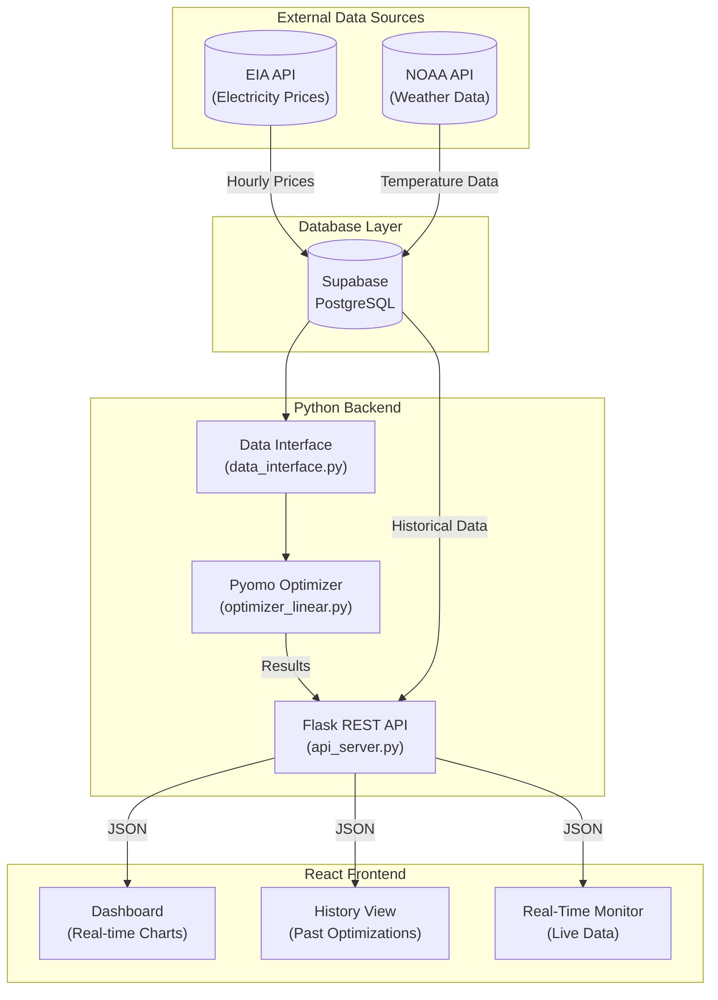
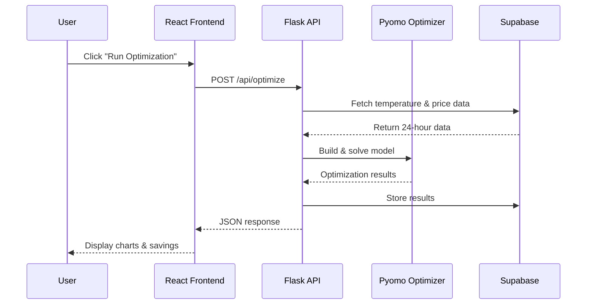
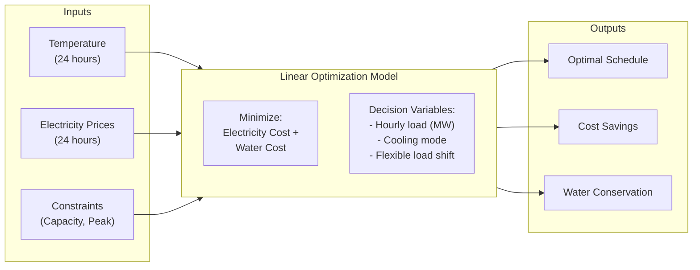
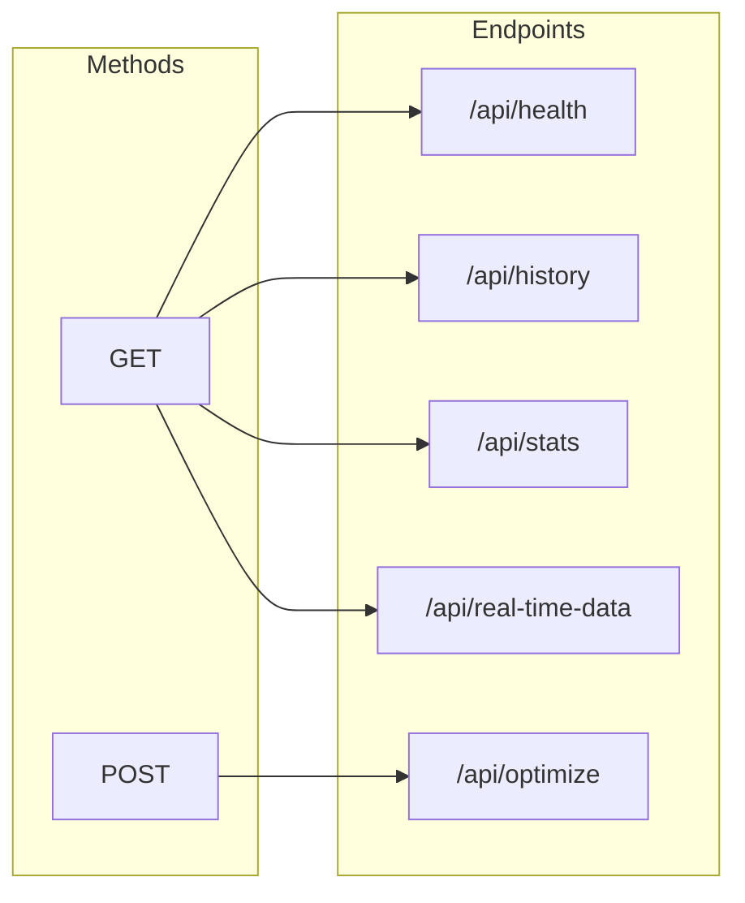
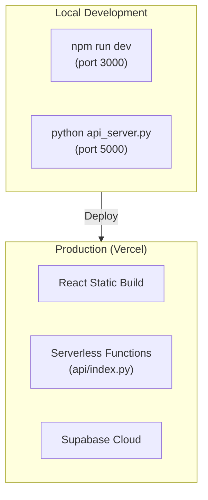

# System Architecture

## Overview

Cooling The Cloud is a full-stack optimization system for Arizona data center operations. The system ingests real-time electricity and weather data, runs a linear optimization model, and presents results through a React dashboard.

---

## System Diagram



---

## Data Flow



---

## Component Details

### Data Sources

| Source | Data | Frequency | Format |
|--------|------|-----------|--------|
| EIA API | Electricity prices, grid demand | Hourly | JSON |
| NOAA API | Temperature, humidity | Hourly | JSON |
| Supabase | Historical data, optimization results | Real-time | PostgreSQL |

### Optimization Engine



### Tech Stack

```
Frontend:        React 18 + Vite + TailwindCSS + Recharts
API:             Flask + Flask-CORS
Optimization:    Pyomo + HiGHS Solver
Database:        Supabase (PostgreSQL)
Data Processing: Pandas + NumPy
```

---

## Directory Structure

```
Cooling-The-Cloud/
├── cooling-cloud-react/     # React frontend
│   ├── src/
│   │   ├── pages/           # Dashboard, History, RealTime
│   │   ├── components/      # UI components
│   │   └── services/        # API client
│   └── package.json
├── model/                   # Optimization engine
│   ├── optimizer_linear.py  # Pyomo linear model
│   └── data_interface.py    # Data loading/validation
├── api_server.py            # Flask REST API
├── data/                    # Database interfaces
│   └── supabase_interface.py
├── scripts/                 # Data fetching scripts
│   ├── fetch_eia.py
│   └── fetch_prices.py
├── tests/                   # Test files
└── docs/                    # Documentation
```

---

## API Architecture



| Endpoint | Method | Purpose |
|----------|--------|---------|
| `/api/health` | GET | Health check |
| `/api/optimize` | POST | Run optimization |
| `/api/history` | GET | Past results |
| `/api/stats` | GET | System statistics |
| `/api/real-time-data` | GET | Current conditions |
| `/api/period-summary` | GET | Period aggregates |
| `/api/monthly-breakdown` | GET | Monthly costs |
| `/api/daily-trends` | GET | Trend data |

---

## Deployment Options


